# 基于HDFS+Hive+Spark的全国蔬菜产业智能分析平台

基于中国蔬菜网真实数据构建的蔬菜产业大数据分析平台，集成 **数据采集 → 清洗 → 数仓建模 → 机器学习预测 → 可视化展示** 全链路能力。

---

## 目录

- [平台概览](#平台概览)
- [技术架构](#技术架构)
- [项目结构](#项目结构)
- [数据模型](#数据模型)
- [快速开始](#快速开始)
- [功能模块详解](#功能模块详解)
  - [1. 数据采集（爬虫层）](#1-数据采集爬虫层)
  - [2. 数据清洗](#2-数据清洗)
  - [3. Hive 数仓（四层架构）](#3-hive-数仓四层架构)
  - [4. Spark 大数据分析](#4-spark-大数据分析)
  - [5. 价格预测模型](#5-价格预测模型)
  - [6. 前端可视化（5 页面 SPA）](#6-前端可视化5-页面-spa)
  - [7. 高级分析功能](#7-高级分析功能)
- [API 接口](#api-接口)
- [测试](#测试)
- [常见问题](#常见问题)
- [许可证](#许可证)

---

## 平台概览

| 维度 | 数据规模 | 说明 |
|------|---------|------|
| 价格数据 | **86 万+** 条 | 全国批发市场每日报价（最低价/最高价/平均价） |
| 种子数据 | **5.4 万+** 条 | 种子供应商产品信息（含点击量、供应地区） |
| 供应商数据 | **8.6 万+** 条 | 蔬菜供应商企业档案（含联系人、企业类型） |
| 覆盖品种 | **42 种** | 白菜、番茄、辣椒、土豆、西瓜等主流蔬菜 |
| 覆盖省份 | **31 个** | 大陆省级行政区（排除港澳台） |
| 批发市场 | **数百家** | 全国主要农产品批发市场 |

---

## 技术架构

```
┌──────────────────────────────────────────────────────────────┐
│                    前端（ECharts 5 SPA）                       │
│  中国地图热力 · 趋势折线 · 柱状图 · 散点图 · 雷达图 ·          │
│  饼图 · 热力矩阵 · 预警面板 · 健康评分表 · PNG导出             │
├──────────────────────────────────────────────────────────────┤
│               API 层（FastAPI + Uvicorn）                      │
│  30+ RESTful 接口 · Swagger 自动文档 · Tags 分组 ·             │
│  单例 DataProcessor · 内存缓存 · 全局异常处理                   │
├──────────────────────────────────────────────────────────────┤
│              数据处理层（Pandas + NumPy）                        │
│  三表加载 · 拼音↔中文映射 · 省份标准化 · IQR过滤 ·             │
│  EMA预测 · 季节性修正 · Pearson相关性 · 供应链健康评分          │
├──────────────────────────────────────────────────────────────┤
│              大数据分析层（Spark + Hive）                        │
│  HDFS分布式存储 · Hive数仓(ODS→DWD→DWS→ADS) ·                 │
│  Spark SQL聚合分析 · MLlib RandomForest价格预测                │
├──────────────────────────────────────────────────────────────┤
│              数据采集层（Python 爬虫）                           │
│  价格爬虫(42品种×31省) · 种子爬虫 · 供应商爬虫 ·               │
│  断点续爬 · 进度持久化 · 备用URL自动回退                          │
└──────────────────────────────────────────────────────────────┘
```

### 核心技术栈

| 模块 | 技术 | 版本/说明 |
|------|------|----------|
| 后端框架 | FastAPI + Uvicorn | v0.115，异步高性能 |
| 数据处理 | Pandas + NumPy | 单例模式加载，内存缓存 |
| 大数据引擎 | Apache Spark + MLlib | v3.5，RandomForestRegressor |
| 数据仓库 | Hive | ODS → DWD → DWS → ADS 四层 |
| 分布式存储 | HDFS | 清洗后 CSV 上传 |
| 前端可视化 | ECharts 5 + 原生 JS | SPA 单页应用，5 个功能页面 |
| 前端模板 | Jinja2 | FastAPI TemplateResponse |
| 数据采集 | BeautifulSoup4 + Requests | 三套爬虫，支持增量更新 |
| 日期选择 | Flatpickr | 轻量级日期选择器 |
| 地图数据 | DataV GeoJSON | 阿里云中国地图 |
| 测试 | Pytest | 22 个单元测试用例 |

---

## 项目结构

```
test/
├── run.py                                  # 服务入口（自动清理 8000 端口 + 启动 Uvicorn）
├── requirements.txt                        # Python 依赖清单
├── README.md                               # 本文档
│
├── config/
│   └── categories.py                       # 全局配置
│       ├── SEED_CATEGORY_SPECS             # 种子品类规格（独立域名/M域名）
│       ├── PRICE_TYPES                     # 价格爬取品种列表（42种）
│       ├── PRICE_CITIES                    # 价格爬取省份列表（31个）
│       ├── PRICE_SUBDOMAIN_MAP             # 品种→子域名映射
│       ├── PRICE_CATEGORY_PATH_MAP         # 特殊品种URL类别路径
│       └── build_price_url()               # 价格URL构建器
│
├── src/
│   ├── api/
│   │   ├── app.py                          # FastAPI 应用实例
│   │   │   ├── 全局异常处理器               # 500 错误统一返回 JSON
│   │   │   ├── 路由注册                    # include_router
│   │   │   └── Swagger 元信息              # title/description/contact/license
│   │   └── routes.py                      # API 路由定义（30+ 接口）
│   │       ├── Tags 分组                  # 数据总览/价格分析/种子与供应商/...
│   │       ├── 查询参数校验                # Query(ge=1, le=500, enum=[...])
│   │       └── CSV 导出                   # StreamingResponse + UTF-8 BOM
│   │
│   ├── data_processing/
│   │   ├── processor.py                # 核心数据处理引擎
│   │   │   ├── DataProcessor           # 单例模式（get_instance 缓存）
│   │   │   ├── 拼音↔中文双向映射        # VEG_PINYIN_TO_CN / VEG_CN_TO_PINYIN
│   │   │   ├── 省份标准化              # PROVINCE_TO_GEO / GEO_TO_PROVINCE
│   │   │   ├── 30+ 分析方法            # 见下方 API 接口表
│   │   │   └── Pandas 降级预测          # EMA(α=0.3) + 季节性修正
│   │   ├── clean_data.py               # 数据清洗脚本（raw → processed）
│   │   │   ├── clean_prices()          # 省份拼音→中文 + 价格去符号 + 去重
│   │   │   ├── clean_seeds()           # 供应地区→省份简称 + 去企业链接
│   │   │   └── clean_suppliers()       # 产地→省份简称 + 点击量转换
│   │   └── unify_clean.py              # 统一清洗工具（高级去重）
│   │
│   ├── scrapers/
│   │   ├── scrape_vegetable_prices.py      # 价格爬虫
│   │   ├── scrape_all_seeds.py             # 种子爬虫
│   │   └── scrape_vegetable_suppliers.py   # 供应商爬虫
│   │
│   └── templates/
│       └── index.html                  # 前端 SPA（ECharts 可视化）
│
├── bigdata/
│   ├── hive/
│   │   ├── create_tables.hql           # Hive 数仓建表（四层架构）
│   │   └── analysis.hql                # Hive 分析查询
│   ├── hdfs/
│   │   └── upload.sh                   # 数据上传 HDFS 脚本（含路径校验）
│   ├── spark/
│   │   └── veg_analysis.py             # PySpark 分析脚本
│   └── export/                         # Spark 导出的分析结果（运行时生成）
│       ├── price_by_province/          # 各省份平均价格
│       ├── price_by_vegetable/         # 各品种平均价格 Top20
│       ├── price_prediction/           # 30天价格预测
│       ├── price_prediction_7d/        # 7天价格预测
│       ├── price_prediction_14d/       # 14天价格预测
│       ├── price_prediction_60d/       # 60天价格预测
│       ├── model_metrics/              # 模型评估指标
│       └── ...                         # 其他分析结果
│
├── data/
│   ├── raw/                              # 爬虫原始数据
│   │   ├── prices/prices_all.csv         # 价格原始数据（含爬取时间）
│   │   ├── prices/prices_progress.json   # 价格爬虫进度文件
│   │   ├── seeds/seeds_all.csv           # 种子原始数据
│   │   └── suppliers/suppliers_all.csv   # 供应商原始数据
│   ├── processed/                        # 清洗后数据（前端直接加载）
│   │   ├── prices_cleaned.csv            # 9列：品种,批发市场,最低价,最高价,平均价,日期,省份,蔬菜类型,省份简称
│   │   ├── seeds_cleaned.csv             # 含：产品名称,供应地区,企业名称,点击量,日期,品种,省份简称
│   │   └── suppliers_cleaned.csv         # 含：产品名称,产地,联系人,企业类型,点击量,日期,品种,省份简称
│   └── analysis/                         # 本地分析结果缓存
│
└── tests/
    └── test_processor.py                 # 单元测试（22个测试用例）
        ├── TestHelperFunctions           # 辅助函数测试（7个）
        ├── TestSeasonalAnalysis          # 季节性分析测试（3个）
        ├── TestPriceAlerts               # 价格预警测试（3个）
        ├── TestSupplyDemandCorrelation   # 供需关联测试（3个）
        ├── TestSupplyChainHealth         # 供应链健康测试（4个）
        └── TestPricePredictionWindow     # 多窗口预测测试（2个）
```

---

## 数据模型

### 价格数据（prices_cleaned.csv）

| 列名 | 类型 | 说明 |
|------|------|------|
| 品种 | STRING | 中文品种名（如：土豆、番茄） |
| 批发市场 | STRING | 批发市场名称 |
| 最低价 | DOUBLE | 当日最低价（元/斤） |
| 最高价 | DOUBLE | 当日最高价（元/斤） |
| 平均价 | DOUBLE | 当日平均价（元/斤） |
| 日期 | DATE | 价格日期（yyyy-MM-dd） |
| 省份 | STRING | 省份拼音（如：gansu） |
| 蔬菜类型 | STRING | 品种拼音编码（如：tudou） |
| 省份简称 | STRING | 省份中文简称（如：甘肃） |

### 种子数据（seeds_cleaned.csv）

| 列名 | 类型 | 说明 |
|------|------|------|
| 产品名称 | STRING | 种子产品名称 |
| 供应地区 | STRING | 供应地区（省>市>县格式） |
| 企业名称 | STRING | 供应商企业名称 |
| 点击量 | INT | 产品点击/浏览量 |
| 日期 | DATE | 发布日期 |
| 品种 | STRING | 中文品种名 |
| 省份简称 | STRING | 省份中文简称 |

### 供应商数据（suppliers_cleaned.csv）

| 列名 | 类型 | 说明 |
|------|------|------|
| 产品名称 | STRING | 供应商产品名称 |
| 产地 | STRING | 产地（省>市>县格式） |
| 联系人 | STRING | 联系人姓名 |
| 企业类型 | STRING | 企业类型（个体/公司/合作社等） |
| 点击量 | INT | 产品点击/浏览量 |
| 日期 | DATE | 发布日期 |
| 品种 | STRING | 中文品种名 |
| 省份简称 | STRING | 省份中文简称 |

### Hive 数仓四层架构

```
ODS（原始层）── 外部表，指向 HDFS 上的清洗后 CSV
  ├── ods_vegetable_prices      价格表（9列）
  ├── ods_vegetable_seeds       种子表（9列）
  └── ods_vegetable_suppliers   供应商表（11列）

DWD（明细层）── 标准化命名 + 过滤港澳台 + 去空值
  ├── dwd_vegetable_prices      品种/省份/市场/价格/日期
  ├── dwd_vegetable_seeds       品种/省份/企业/点击量
  └── dwd_vegetable_suppliers   品种/省份/联系人/企业类型

DWS（汇总层）── 品种×省份维度聚合三表
  └── dws_vegetable_panorama    均价/极值/种子数/供应商数

ADS（应用层）── 直接对接前端 API
  ├── ads_variety_province_profile   品种-省份综合画像（含供应链成熟度、价格竞争力）
  └── ads_variety_ranking            品种竞争力排名（种子×0.3+供应商×0.4+价格×0.3）
```

---

## 快速开始

### 环境要求

#### 基础环境（必需）

| 组件 | 版本 | 说明 |
|------|------|------|
| Python | 3.10+ | 推荐 3.13，项目开发和测试均基于此版本 |
| pip | 最新版 | 包管理器 |

#### 大数据环境

大数据组件仅在需要运行 Spark MLlib 价格预测和 Hive 数仓分析时才需要安装。不安装时，平台自动使用 Pandas 降级方案替代。

| 组件 | 版本 | 说明 | 验证命令 |
|------|------|------|----------|
| Apache Spark | 3.5.5 | 需 Scala 2.12 + Java 8 | `spark-submit --version` |
| Hadoop HDFS | 3.1.3 | 伪分布式或完全分布式均可 | `hadoop version` |
| Hive | 3.1.2 | 基于 Hadoop 的数仓引擎 | `hive --version` |
| Java (JDK) | 1.8.x | Spark/Hadoop 依赖 | `java -version` |

> **版本兼容性**：Spark 3.5.5 必须搭配 Scala 2.12.x 和 Java 8（不支持 Java 11+）。Hive 3.1.2 需搭配 Hadoop 3.1.3。

### 大数据环境搭建（Linux）

以下以 Ubuntu/CentOS 单机伪分布式为例，完整搭建 Hadoop + Hive + Spark 环境。

#### 1. 安装 JDK 8

```bash
# Ubuntu
sudo apt-get install openjdk-8-jdk -y

# CentOS
sudo yum install java-1.8.0-openjdk-devel -y

# 配置环境变量（追加到 ~/.bashrc）
export JAVA_HOME=/usr/lib/jvm/java-8-openjdk-amd64
export PATH=$JAVA_HOME/bin:$PATH

# 验证
java -version
# 预期输出: openjdk version "1.8.0_xxx"
```

#### 2. 安装 Hadoop 3.1.3（伪分布式）

```bash
# 下载并解压
cd /usr/local
sudo wget https://archive.apache.org/dist/hadoop/common/hadoop-3.1.3/hadoop-3.1.3.tar.gz
sudo tar -xzf hadoop-3.1.3.tar.gz
sudo ln -s hadoop-3.1.3 hadoop

# 环境变量（~/.bashrc）
export HADOOP_HOME=/usr/local/hadoop
export PATH=$HADOOP_HOME/bin:$HADOOP_HOME/sbin:$PATH
export HADOOP_CONF_DIR=$HADOOP_HOME/etc/hadoop

# core-site.xml — 配置 HDFS NameNode 地址
cat > $HADOOP_CONF_DIR/core-site.xml << 'EOF'
<configuration>
  <property>
    <name>fs.defaultFS</name>
    <value>hdfs://localhost:9000</value>
  </property>
</configuration>
EOF

# hdfs-site.xml — 伪分布式副本数设为 1
cat > $HADOOP_CONF_DIR/hdfs-site.xml << 'EOF'
<configuration>
  <property>
    <name>dfs.replication</name>
    <value>1</value>
  </property>
  <property>
    <name>dfs.namenode.name.dir</name>
    <value>/usr/local/hadoop/data/namenode</value>
  </property>
  <property>
    <name>dfs.datanode.data.dir</name>
    <value>/usr/local/hadoop/data/datanode</value>
  </property>
</configuration>
EOF

# 格式化 NameNode（首次）
hdfs namenode -format

# 启动 HDFS
start-dfs.sh

# 验证
jps    # 应看到 NameNode, DataNode, SecondaryNameNode
hdfs dfs -ls /
```

#### 3. 安装 Hive 3.1.2

```bash
# 下载并解压
cd /usr/local
sudo wget https://archive.apache.org/dist/hive/hive-3.1.2/apache-hive-3.1.2-bin.tar.gz
sudo tar -xzf apache-hive-3.1.2-bin.tar.gz
sudo ln -s apache-hive-3.1.2-bin hive

# 环境变量（~/.bashrc）
export HIVE_HOME=/usr/local/hive
export PATH=$HIVE_HOME/bin:$PATH

# 初始化 Hive Metastore（首次，使用内嵌 Derby 数据库）
schematool -dbType derby -initSchema

# 启动 Hive 验证
hive -e "SHOW DATABASES;"
```

#### 4. 安装 Spark 3.5.5

```bash
# 下载并解压（选择预编译的 Hadoop 3 版本）
cd /usr/local
sudo wget https://archive.apache.org/dist/spark/spark-3.5.5/spark-3.5.5-bin-hadoop3.tgz
sudo tar -xzf spark-3.5.5-bin-hadoop3.tgz
sudo ln -s spark-3.5.5-bin-hadoop3 spark

# 环境变量（~/.bashrc）
export SPARK_HOME=/usr/local/spark
export PATH=$SPARK_HOME/bin:$SPARK_HOME/sbin:$PATH

# spark-env.sh — 关联 Hadoop 和 Java
cp $SPARK_HOME/conf/spark-env.sh.template $SPARK_HOME/conf/spark-env.sh
cat >> $SPARK_HOME/conf/spark-env.sh << 'EOF'
export JAVA_HOME=/usr/lib/jvm/java-8-openjdk-amd64
export HADOOP_HOME=/usr/local/hadoop
export HADOOP_CONF_DIR=$HADOOP_HOME/etc/hadoop
export SPARK_DIST_CLASSPATH=$(/usr/local/hadoop/bin/hadoop classpath)
export PYSPARK_PYTHON=python3
export PYSPARK_DRIVER_PYTHON=python3
EOF

# 验证
spark-submit --version
# 预期: Spark 3.5.5, Scala 2.12, Java 1.8.0_xxx

spark-shell
# 预期: 成功进入 Scala REPL，无报错
```

#### 5. 环境变量汇总

将以下内容统一追加到 `~/.bashrc`：

```bash
# === Java ===
export JAVA_HOME=/usr/lib/jvm/java-8-openjdk-amd64
export PATH=$JAVA_HOME/bin:$PATH

# === Hadoop ===
export HADOOP_HOME=/usr/local/hadoop
export HADOOP_CONF_DIR=$HADOOP_HOME/etc/hadoop
export PATH=$HADOOP_HOME/bin:$HADOOP_HOME/sbin:$PATH

# === Hive ===
export HIVE_HOME=/usr/local/hive
export PATH=$HIVE_HOME/bin:$PATH

# === Spark ===
export SPARK_HOME=/usr/local/spark
export PATH=$SPARK_HOME/bin:$SPARK_HOME/sbin:$PATH

# 生效
source ~/.bashrc
```

### 安装与运行

#### 基础模式（无需大数据环境）

```bash
# 1. 克隆项目
git clone <repo-url> && cd test

# 2. 安装 Python 依赖
pip install -r requirements.txt

# 3. 运行爬虫采集数据（首次）
python src/scrapers/scrape_vegetable_prices.py
python src/scrapers/scrape_all_seeds.py
python src/scrapers/scrape_vegetable_suppliers.py

# 4. 数据清洗（raw → processed）
python src/data_processing/clean_data.py

# 5. 启动 Web 服务
python run.py
```

服务启动后访问：
- **前端页面**: http://localhost:8000
- **API 文档**: http://localhost:8000/docs （Swagger UI，可在线调试所有接口）

> 基础模式下，价格预测使用 Pandas EMA 降级方案，分析结果由 Pandas 实时计算。

#### 数据更新

爬虫内置断点续爬机制，重新运行会自动跳过已完成的任务：

```bash
# 价格爬虫（支持断点续爬，自动跳过已完成品种×省份组合）
python src/scrapers/scrape_vegetable_prices.py

# 查看爬取进度
python src/scrapers/scrape_vegetable_prices.py --status

# 清理进度中无数据的无效条目
python src/scrapers/scrape_vegetable_prices.py --cleanup

# 种子 / 供应商爬虫（同样支持断点续爬）
python src/scrapers/scrape_all_seeds.py
python src/scrapers/scrape_vegetable_suppliers.py

# 爬取完成后需重新清洗数据
python src/data_processing/clean_data.py
```

### 大数据分析流水线（Spark + Hive + HDFS）

以下步骤在大数据环境搭建完成后执行，实现从数据上传到 MLlib 价格预测的完整流水线。

#### 流水线概览

```
本地 CSV (data/processed/)
    │
    ▼  upload.sh
HDFS (/vegetable_data/raw/)
    │
    ▼  create_tables.hql
Hive 数仓 (ODS → DWD → DWS → ADS)
    │
    ▼  veg_analysis.py (spark-submit)
Spark 分析 + MLlib 预测
    │
    ▼
bigdata/export/*.csv  ──→  Web 服务自动加载
```

#### 步骤 1：上传数据到 HDFS

```bash
bash bigdata/hdfs/upload.sh
```
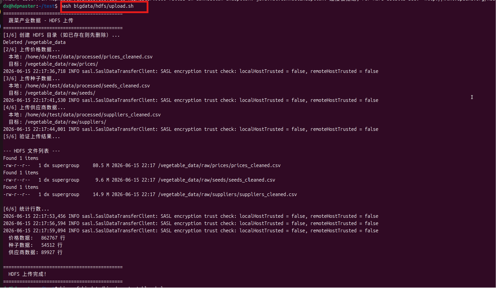
脚本自动完成以下操作：
- 检查本地清洗后 CSV 是否存在
- 创建 HDFS 目录结构：`/vegetable_data/raw/{prices,seeds,suppliers}/`
- 上传 `prices_cleaned.csv`、`seeds_cleaned.csv`、`suppliers_cleaned.csv`
- 验证上传结果并统计行数

**HDFS 目录结构**：

```
/vegetable_data/
├── raw/
│   ├── prices/prices_cleaned.csv     # 86万+ 条价格记录
│   ├── seeds/seeds_cleaned.csv       # 5.4万+ 条种子记录
│   └── suppliers/suppliers_cleaned.csv # 8.6万+ 条供应商记录
```

#### 步骤 2：Hive 数仓建表（首次运行）

```bash
# 创建数据库 + 四层表结构
hive -f bigdata/hive/create_tables.hql
```
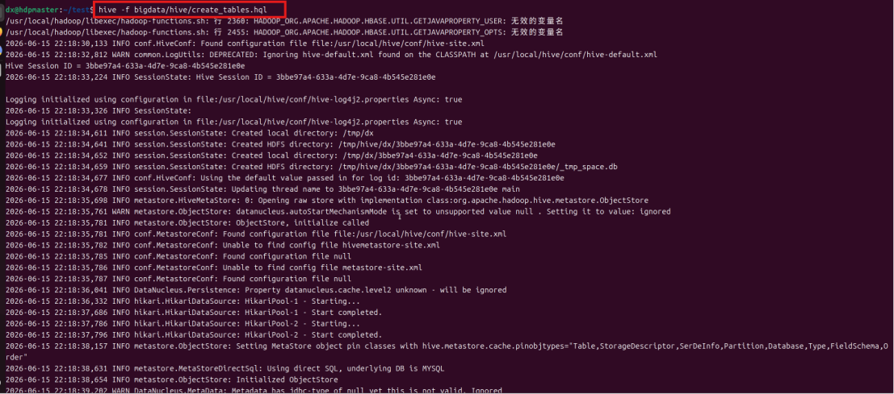
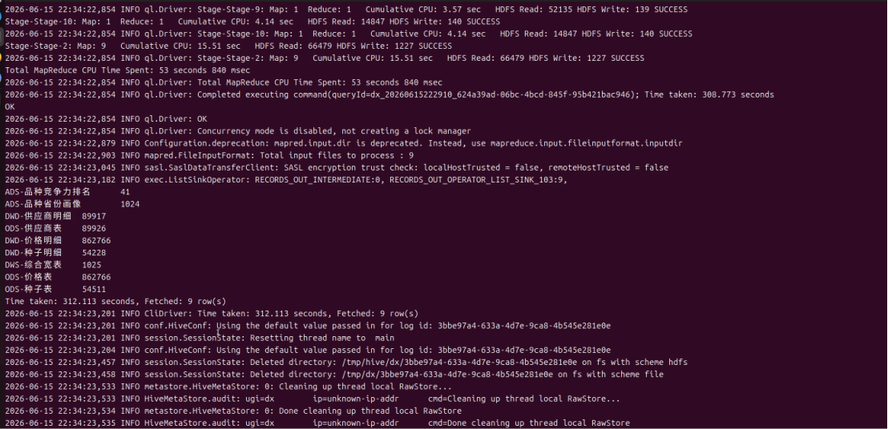

**建表过程**（自动执行，约 2-5 分钟）：

| 阶段 | 操作 | 耗时 |
|------|------|------|
| ODS 层 | 创建 3 张外部表，映射 HDFS CSV | 秒级 |
| DWD 层 | 标准化列名 + 过滤港澳台 + 去空值 | 10-30 秒 |
| DWS 层 | 品种×省份三表 LEFT JOIN 聚合 | 30-60 秒 |
| ADS 层 | 综合画像 + 竞争力排名 | 10-30 秒 |
| 验证 | 统计各层记录数 | 秒级 |

**验证建表结果**：

```bash
hive -e "
USE vegetable_db;
SELECT 'ODS-价格' AS layer, COUNT(*) AS cnt FROM ods_vegetable_prices
UNION ALL
SELECT 'DWD-价格', COUNT(*) FROM dwd_vegetable_prices
UNION ALL
SELECT 'DWS-综合宽表', COUNT(*) FROM dws_vegetable_panorama
UNION ALL
SELECT 'ADS-画像', COUNT(*) FROM ads_variety_province_profile;
"
```
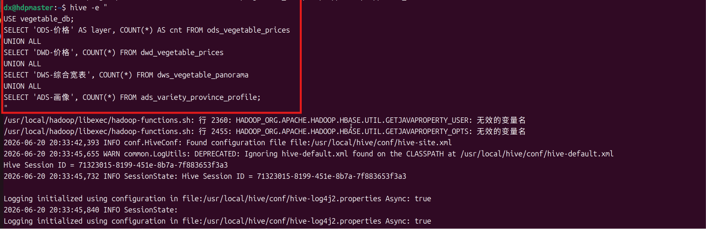
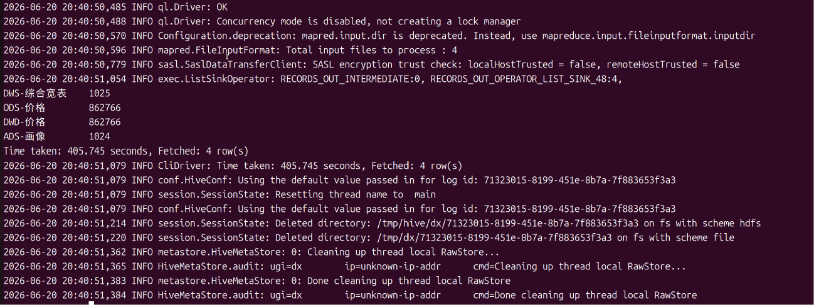
#### 步骤 3：运行 Hive 分析查询（可选）

```bash
# 执行 6 个核心分析（建表时已包含，此步骤可跳过）
hive -f bigdata/hive/analysis.hql
```

Hive 分析产出 6 张结果表：

| 结果表 | 内容 |
|--------|------|
| `result_price_by_province` | 各省份平均价格排名 |
| `result_price_by_vegetable` | 品种平均价格 Top 20 |
| `result_seed_by_province` | 种子供应省份分布 |
| `result_supplier_by_province` | 供应商省份分布 |
| `result_vegetable_score` | 品种综合评分 Top 15 |
| `result_price_trend` | 每日均价趋势序列 |

#### 步骤 4：运行 Spark 分析 + MLlib 价格预测

```bash
# 确保 HDFS 已启动
start-dfs.sh

# 执行 Spark 分析（含 MLlib 随机森林价格预测）
spark-submit \
    --packages org.apache.spark:spark-mllib_2.12:3.5.5 \
    --driver-memory 4g \
    --driver-cores 2 \
    bigdata/spark/veg_analysis.py
```

**Spark 运行参数说明**：

| 参数 | 值 | 说明 |
|------|-----|------|
| `--packages` | `spark-mllib_2.12:3.5.5` | 引入 MLlib 机器学习库 |
| `--driver-memory` | 4g | Driver 堆内存（86万条数据建议 4g） |
| `--driver-cores` | 2 | Driver CPU 核数 |
| `spark.sql.shuffle.partitions` | 8 | 脚本内配置，减少小数据集分区开销 |
| `spark.local.dir` | `/tmp/spark-tmp` | Shuffle 临时文件目录 |
| `spark.driver.maxResultSize` | 2g | Driver 端 collect 最大数据量 |

**Spark 运行过程输出**（约 5-15 分钟）：

```
=======================================================
  PySpark 蔬菜产业数据分析
=======================================================
[1/9] 加载价格数据（清洗后）...
      价格数据: 862,153 条
[2/9] 加载种子数据（清洗后）...
      种子数据: 54,231 条
[3/9] 加载供应商数据（清洗后）...
      供应商数据: 86,442 条
[4/9] 分析: 各省份平均价格...
[4/9] 分析: 各品种平均价格...
[5/9] 分析: 种子/供应商分布 + 品种评分...
[6/9] 分析: 价格趋势...
[7/9] 分析: 品种-省份热力矩阵...
[8/9] 跨表关联分析: 三表JOIN综合画像...
[9/9] MLlib 价格预测...
      离群值过滤: 移除 28,901 条极端价格记录
      ML训练样本数: 833,252
      训练集: 666,598 | 测试集: 166,654
      模型评估 → RMSE: 0.1543 | R²: 0.9914 | MAE: 0.0892
      [7天]  预测日期: 2026-06-18 | 品种数: 30
      [14天] 预测日期: 2026-06-25 | 品种数: 30
      [30天] 预测日期: 2026-07-11 | 品种数: 30
      [60天] 预测日期: 2026-08-10 | 品种数: 30

[导出完成] 共 9 项分析结果：
  导出目录: bigdata/export
  ─────────────────────────────────────────
  基础分析:
    price_by_province/      各省份平均价格
    price_by_vegetable/     各品种平均价格 Top 20
    seed_by_province/       种子供应省份分布
    supplier_by_province/   供应商省份分布
    vegetable_score/        品种综合评分
    price_trend/            价格趋势（历史）
    heatmap_data/           省份-品种价格热力图
  跨表关联分析:
    cross_table_profile/    品种-省份综合画像（三表JOIN）
  MLlib 价格预测:
    price_prediction_7d/    未来7天价格预测
    price_prediction_14d/   未来14天价格预测
    price_prediction/       未来30天价格预测
    price_prediction_60d/   未来60天价格预测
    model_metrics/          模型评估指标
```
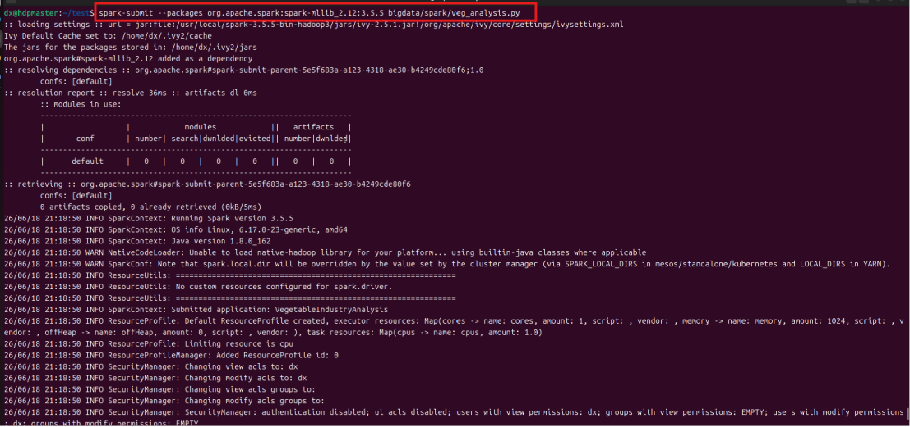
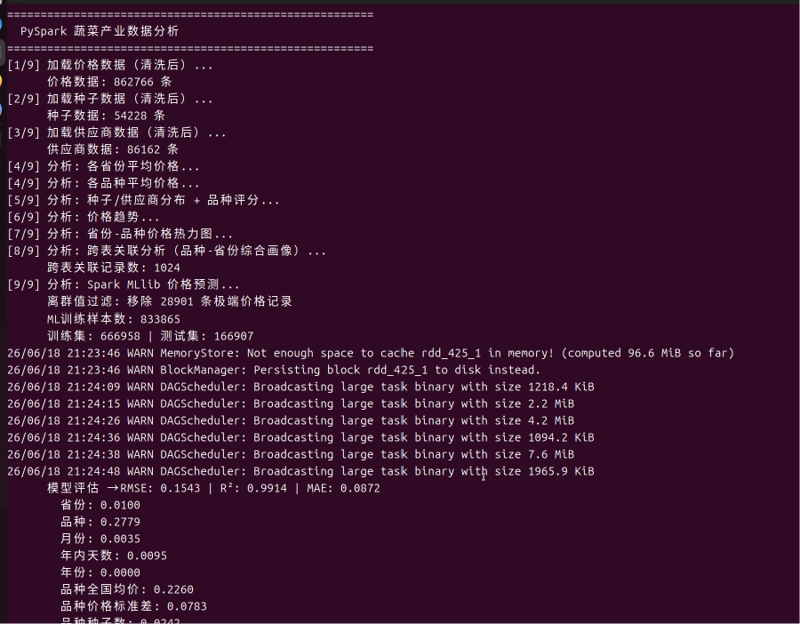
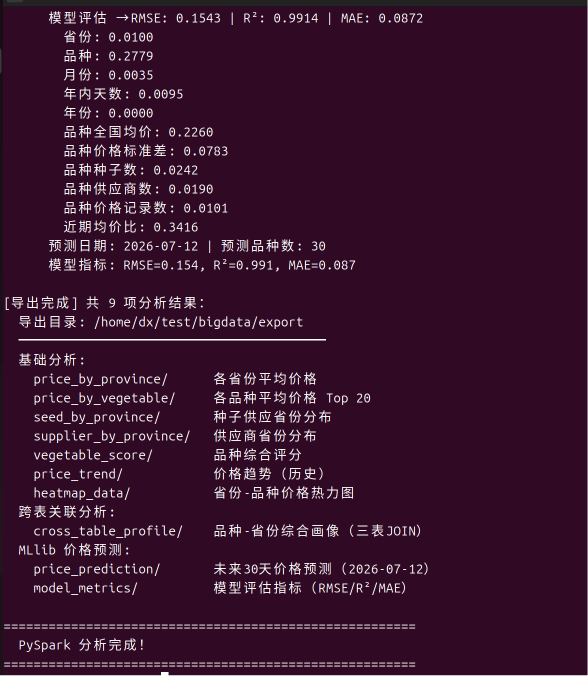
#### 步骤 5：验证导出结果

```bash
# 查看导出目录
ls bigdata/export/

# 查看 30 天预测结果样例
cat bigdata/export/price_prediction/part-*.csv | head -5
# 预期输出:
# 品种,predicted_price,current_avg_price,forecast_date
# 大蒜,5.82,5.41,2026-07-11
# 生姜,5.15,4.98,2026-07-11
# ...
```
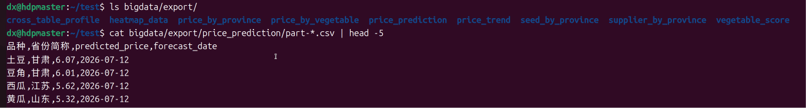

#### 步骤 6：启动 Web 服务（自动加载大数据结果）

```bash
python run.py
```

`DataProcessor` 启动时自动扫描 `bigdata/export/` 目录，优先加载 Spark 预计算结果。前端页面切换时直接使用预计算数据，无需等待实时计算。

#### 数据更新流程


```bash
# 1. 重新爬取（断点续爬，自动跳过已完成任务） + 清洗
python src/scrapers/scrape_vegetable_prices.py
python src/data_processing/clean_data.py

# 2. 重新上传 HDFS
bash bigdata/hdfs/upload.sh

# 3. 重新运行 Spark 分析
spark-submit --packages org.apache.spark:spark-mllib_2.12:3.5.5 bigdata/spark/veg_analysis.py

# 4. 刷新 Web 服务缓存
curl -X POST http://localhost:8000/api/data/refresh
```

---

## 功能模块详解

### 1. 数据采集（爬虫层）

三套爬虫均内置断点续爬机制，通过进度文件自动跳过已完成任务：

| 参数 | 行为 |
|------|------|
| （无参数） | 全量爬取（自动跳过已完成任务） |
| `--status` | 查看爬取进度 |
| `--cleanup` | 清理进度中无数据的无效条目（仅价格爬虫） |

**价格爬虫** (`scrape_vegetable_prices.py`)：
- 遍历 42 个品种 × 31 个省份 = 1302 个组合
- 每个组合自动识别总页数（支持回退机制）
- URL 策略：独立域名 / M域名 / 类别路径 / 全国模式（按品种自动选择）
- 提取字段：品种、批发市场、最低价、最高价、平均价、日期、省份

**种子爬虫** (`scrape_all_seeds.py`)：
- 遍历品种分页列表，提取产品信息
- 提取字段：产品名称、供应地区、企业名称、点击量、日期

**供应商爬虫** (`scrape_vegetable_suppliers.py`)：
- 遍历品种分页列表，提取供应商档案
- 提取字段：产品名称、产地、联系人、企业类型、点击量、日期

### 2. 数据清洗

`clean_data.py` 将 `data/raw/` 清洗为 `data/processed/`：

| 清洗步骤 | 价格数据 | 种子数据 | 供应商数据 |
|---------|---------|---------|-----------|
| 省份标准化 | 拼音→中文简称映射 | 供应地区→提取省份 | 产地→提取省份 |
| 数值转换 | 去掉￥/元符号→浮点数 | 点击量→整数 | 点击量→整数 |
| 日期转换 | 字符串→datetime | — | — |
| 去重 | 保留最后一条 | 保留最后一条 | 保留最后一条 |
| 过滤 | 去空均价/空日期 | — | — |
| 列清理 | 删除爬取时间列 | 删除企业链接 | — |

**处理器加载时的二次清洗**（`processor.py`）：
- 品种名用 `品种`（中文）列覆盖 `蔬菜类型`（拼音）列，修正爬虫脏数据
- 过滤港澳台 + `zhongguo` 异常省份
- 拼音↔中文双向映射，前端统一显示中文名

### 3. Hive 数仓（四层架构）

`bigdata/hive/create_tables.hql` 实现了标准数仓分层：

| 层级 | 表名 | 用途 |
|------|------|------|
| **ODS** | `ods_vegetable_prices/seeds/suppliers` | 外部表，直接映射 HDFS CSV |
| **DWD** | `dwd_vegetable_prices/seeds/suppliers` | 标准化明细（统一列名、过滤脏数据） |
| **DWS** | `dws_vegetable_panorama` | 品种×省份聚合宽表（三表 LEFT JOIN） |
| **ADS** | `ads_variety_province_profile` | 品种-省份画像（供应链成熟度 + 价格竞争力指数） |
| **ADS** | `ads_variety_ranking` | 品种竞争力排名（综合评分） |

**DWS 综合宽表** `dws_vegetable_panorama` 字段：
- `variety`, `province` — 品种+省份维度
- `price_record_count`, `avg_price_num`, `min_price_num`, `max_price_num` — 价格统计
- `seed_count`, `supplier_count` — 供应链指标

**ADS 画像表**计算了：
- **供应链成熟度** = 种子数 + 供应商数
- **价格竞争力** = 该省该品种均价 / 全国该品种均价（<1 表示低于全国均价，更有竞争力）

### 4. Spark 大数据分析

`bigdata/spark/veg_analysis.py` 包含 9 步分析流水线：

| 步骤 | 内容 | 导出目录 |
|------|------|---------|
| 1-3 | 加载三表数据（过滤港澳台） | — |
| 4 | 各省份平均价格 | `price_by_province/` |
| 4 | 各品种平均价格 Top20 | `price_by_vegetable/` |
| 5 | 种子供应省份分布 | `seed_by_province/` |
| 5 | 供应商省份分布 | `supplier_by_province/` |
| 5 | 品种综合评分（种子+供应商+价格稳定性） | `vegetable_score/` |
| 6 | 价格趋势（历史日均价格序列） | `price_trend/` |
| 7 | 品种-省份价格热力矩阵 | `heatmap_data/` |
| 8 | 跨表关联分析（三表 JOIN 综合画像） | `cross_table_profile/` |
| 9 | **MLlib 随机森林价格预测**（多窗口） | `price_prediction*/` |

**Spark 配置**：
- `spark.driver.memory`: 4g
- `spark.sql.shuffle.partitions`: 8
- Checkpoint 目录: `/tmp/spark-checkpoint`（截断 RDD 血统，避免 shuffle 文件丢失）

### 5. 价格预测模型

平台实现了双路径价格预测，优先使用 Spark MLlib，无 Spark 环境时自动回退到 Pandas。

#### Spark MLlib 路径（优先）

| 组件 | 配置 |
|------|------|
| 算法 | `RandomForestRegressor` |
| 树数量 | 50 棵 |
| 最大深度 | 10 层 |
| maxBins | 64 |
| minInstancesPerNode | 20 |

**11 个特征**：

| # | 特征 | 说明 |
|---|------|------|
| 1 | `province_idx` | 省份索引（StringIndexer编码） |
| 2 | `veg_idx` | 品种索引（StringIndexer编码） |
| 3 | `month` | 月份（1-12） |
| 4 | `day_of_year` | 年内天数（1-366） |
| 5 | `year` | 年份 |
| 6 | `variety_national_avg` | 品种全国均价 |
| 7 | `variety_price_std` | 品种价格标准差 |
| 8 | `variety_seed_count` | 品种种子总数 |
| 9 | `variety_supplier_count` | 品种供应商总数 |
| 10 | `variety_price_records` | 品种价格记录数 |
| 11 | `price_vs_recent` | 近期30天均价比 |

**数据预处理流水线**：
1. **IQR 离群值过滤**：每品种剔除超出 `[Q1-1.5×IQR, Q3+1.5×IQR]` 的极端价格
2. **季节性修正**：计算品种月度均价/年均价比率，预测时乘以 `未来月/当前月` 的季节性比率
3. **安全裁剪**：预测值限制在近期30天均价的 ±30% 范围内
4. **加权聚合**：品种×省份组合按历史数据量加权平均到品种级别

**多窗口输出**：7天 / 14天 / 30天 / 60天 四个预测窗口，各导出独立 CSV。

#### Pandas 降级路径（自动回退）

当 `bigdata/export/price_prediction*/` 目录不存在时，`processor.py` 使用 Pandas 实时计算：

| 组件 | 配置 |
|------|------|
| 算法 | EMA（指数移动平均，α=0.3） |
| 离群值过滤 | IQR 方法（向量化 transform 写法） |
| 季节性修正 | 月度均价 / 年均价 因子 |
| 裁剪 | ±25% 硬裁剪（基于 EMA 值） |

**预测公式**：`predicted = EMA × (未来月季节因子 / 当前月季节因子)`

### 6. 前端可视化（5 页面 SPA）

前端基于 ECharts 5 构建的单页应用，通过侧边栏导航切换页面：

#### 页面 1：数据总览
- **统计卡片**：价格记录数、种子数、供应商数、品种数、省份数、市场数（数字动画）
- **中国地图**：各省份蔬菜平均批发价格热力地图（点击省份可钻取查看种子明细）
- **品种价格 Top20**：横向柱状图
- **省份综合对比**：支持选择最多 5 个省份横向比较（种子数、供应商数、均价、品种数、市场数）
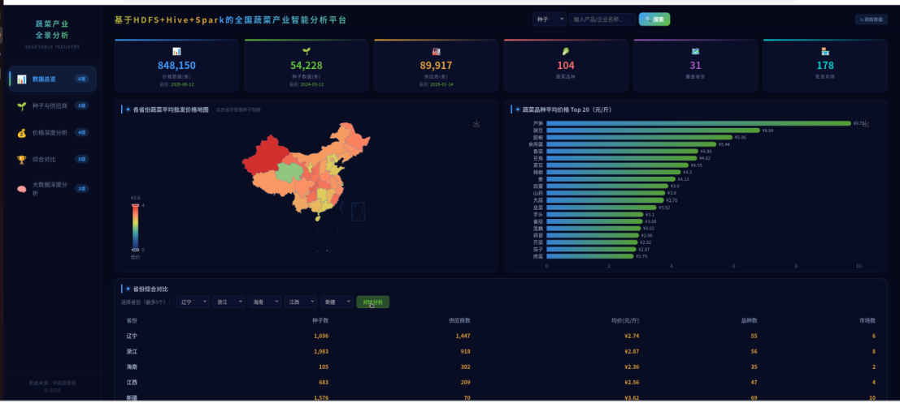
#### 页面 2：种子与供应商
- **种子供应省份分布**：柱状图
- **供应商省份分布**：柱状图
- **种子品种分布 Top15**：柱状图
- **供应商品种分布 Top15**：柱状图
- **供应商企业类型分布**：饼图（点击扇区查看明细弹窗）
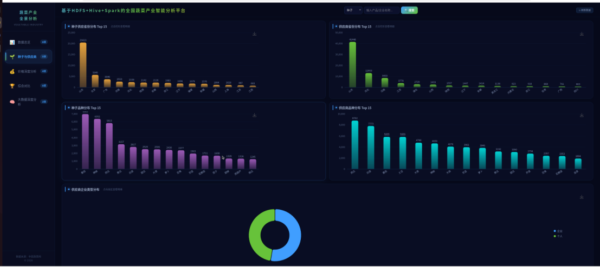
#### 页面 3：价格深度分析
- **价格走势折线图**：支持按品种筛选 + 日期范围选择（Flatpickr 日历）
- **价格波动排行 Top15**：基于变异系数（CV = σ/μ）
- **批发市场排名**：记录数柱状图
- **季节性分析**：各品种 12 个月均价趋势折线图
- **价格预警面板**：近期价格异常波动品种（红色 >30%、黄色 >20%）
- **品种-省份热力矩阵**：横轴省份、纵轴品种的颜色编码价格矩阵
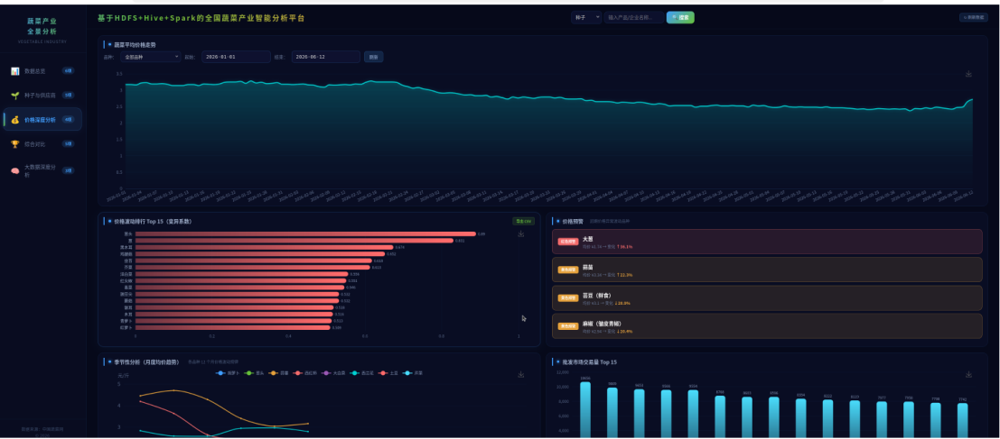
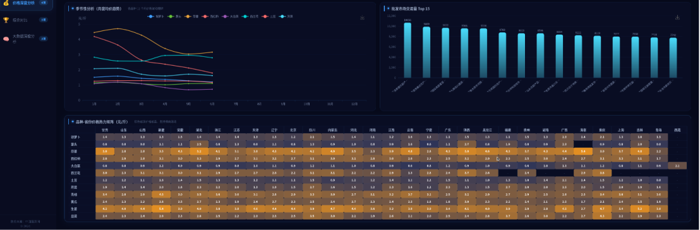
#### 页面 4：综合对比
- **品种综合评分**：种子丰富度 + 供应商数量 + 综合分（双Y轴柱状+折线）
- **省份雷达图**：种子数 / 供应商数 / 均价三维雷达对比
- **多品种横向对比**：最多 6 个品种对比均价、波动率、种子数等
- **时间段对比**：同一品种在不同时间段的均价变化
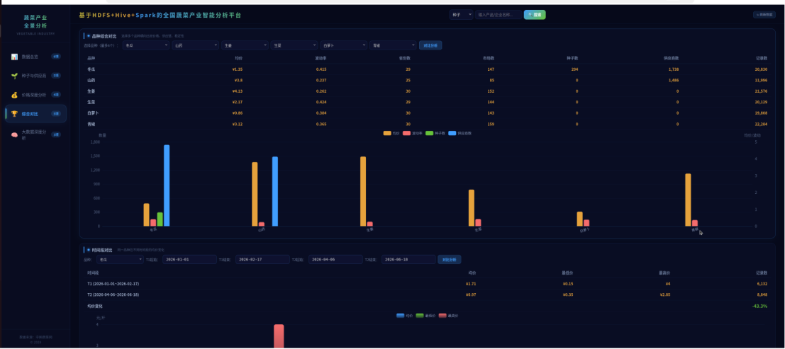
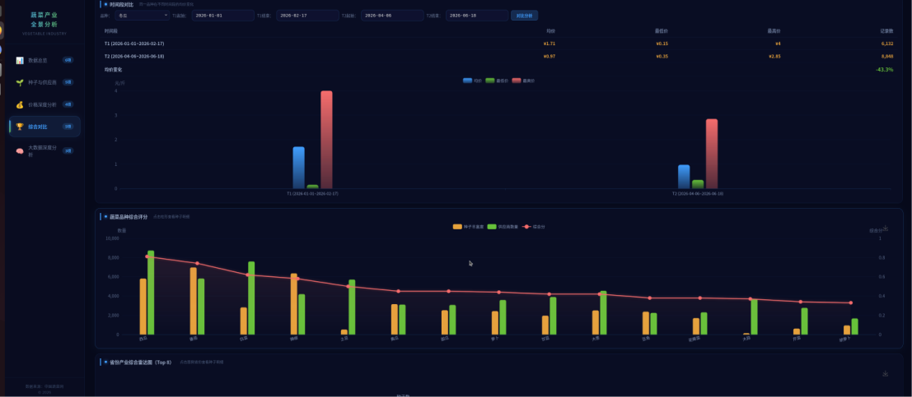

#### 页面 5：大数据深度分析
- **供应链成熟度**：品种×省份三表 JOIN 综合画像（堆叠柱状图）
- **跨表关联散点图**：种子数 vs 供应商数（气泡大小=均价）
- **价格预测 vs 当前均价**：柱状图 + 置信区间 + 多窗口切换（7/14/30/60天）
- **数据质量报告**：各品种价格记录数 + 完整度
- **供需关联分析**：种子数/供应商数 vs 价格波动率的 Pearson 相关性散点图
- **供应链健康评分表**：品种 + 等级(A/B/C/D) + 模拟预测


**所有图表均支持 PNG 导出**（ECharts toolbox.saveAsImage，2倍像素比）。

### 7. 高级分析功能

#### 季节性分析
- 方法：计算各品种 12 个月的月均价，除以年均价得到季节性指数
- 前端：折线图展示 Top8 品种的月度价格波动规律
- API：`GET /analysis/seasonal?top_n=8`

#### 价格预警
- 方法：对比品种近期均价与历史均价，计算变化率
- 阈值：**红色预警** >30% 变化、**黄色预警** >20% 变化
- 前端：卡片式面板，显示品种名、当前均价、变化方向与幅度
- API：`GET /price/alerts`

#### 供需关联分析
- 方法：计算各品种的种子数/供应商数与价格波动率（变异系数 CV）的 **Pearson 相关系数**
- 公式：`r = Σ((x-x̄)(y-ȳ)) / √(Σ(x-x̄)² × Σ(y-ȳ)²)`
- 前端：双散点图（左：种子数 vs 波动率，右：供应商数 vs 波动率），标注 r 值
- API：`GET /analysis/supply-demand`

#### 供应链健康评分
- 公式：`health_score = 0.4 × norm(种子数) + 0.3 × norm(供应商数) + 0.3 × (1 - norm(波动率))`
- 归一化：Min-Max 归一化到 [0, 1]
- 等级：**A**（≥0.7）、**B**（≥0.5）、**C**（≥0.3）、**D**（<0.3）
- 模拟预测：假设种子数和供应商数各增加 20%，计算健康指数变化
- 前端：表格展示品种、种子数、供应商数、波动率、健康指数、等级、模拟提升
- API：`GET /analysis/supply-chain-health`

---

## API 接口

所有接口均可通过 `/docs`（Swagger UI）在线调试，按功能标签分组：

### 数据总览

| 方法 | 路径 | 说明 |
|------|------|------|
| GET | `/overview` | 数据总量、品种数、省份数、市场数、最新日期 |
| GET | `/vegetable/types` | 所有蔬菜品种列表（下拉选择用） |
| GET | `/province/list` | 所有省份列表 |

### 价格分析

| 方法 | 路径 | 参数 | 说明 |
|------|------|------|------|
| GET | `/price/province` | — | 各省份平均价格（地图热力） |
| GET | `/price/vegetable` | `top_n` | 品种平均价格 Top N |
| GET | `/price/trend` | `vegetable_type`, `date_from`, `date_to` | 价格趋势时间序列 |
| GET | `/price/volatility` | `top_n` | 价格波动排行（变异系数 CV） |
| GET | `/price/heatmap` | `top_vegs`, `top_provs` | 品种×省份价格热力矩阵 |
| GET | `/price/scatter/{type}` | — | 品种价格散点图（最低价 vs 最高价） |
| GET | `/price/prediction` | `window` ∈ [7,14,30,60] | 价格预测（Spark MLlib / Pandas降级） |
| GET | `/price/alerts` | — | 价格预警（红色>30%、黄色>20%） |

### 种子与供应商

| 方法 | 路径 | 参数 | 说明 |
|------|------|------|------|
| GET | `/seed/distribution` | — | 种子供应省份分布 |
| GET | `/seed/category` | `top_n` | 种子品种分布 Top N |
| GET | `/seed/categories_by_province` | `province` | 某省份种子品种分布 |
| GET | `/supplier/distribution` | — | 供应商省份分布 |
| GET | `/supplier/category` | `top_n` | 供应商品种分布 Top N |
| GET | `/supplier/type` | — | 供应商企业类型分布 |
| GET | `/supplier/categories_by_province` | `province` | 某省份供应商品种分布 |

### 大数据深度分析

| 方法 | 路径 | 参数 | 说明 |
|------|------|------|------|
| GET | `/analysis/cross-table` | `vegetable`, `province`, `top_n` | 品种-省份综合画像（三表JOIN） |
| GET | `/analysis/cross-table/summary` | — | 跨表关联汇总（供应链成熟度分布） |
| GET | `/analysis/data-quality` | — | 数据质量报告（记录数+完整性） |
| GET | `/analysis/seasonal` | `top_n` | 季节性分析（12月均价趋势） |
| GET | `/analysis/supply-demand` | — | 供需关联（Pearson相关性） |
| GET | `/analysis/supply-chain-health` | — | 供应链健康评分+等级 |

### 对比分析

| 方法 | 路径 | 参数 | 说明 |
|------|------|------|------|
| GET | `/province/compare` | `provinces`（逗号分隔） | 多省份对比（最多5个） |
| GET | `/variety/compare` | `varieties`（逗号分隔） | 多品种对比（最多6个） |
| POST | `/analysis/time-compare` | JSON body | 时间段对比（品种+两段日期） |
| GET | `/province/radar` | — | 省份雷达图数据 |
| GET | `/vegetable/score` | — | 品种综合评分 |

### 搜索与导出

| 方法 | 路径 | 参数 | 说明 |
|------|------|------|------|
| GET | `/search/prices` | `province`, `category`, `page`, `page_size` | 搜索价格数据 |
| GET | `/search/seeds` | `keyword`, `province`, `category`, `page`, `page_size` | 搜索种子数据 |
| GET | `/search/suppliers` | `keyword`, `province`, `category`, `ent_type`, `page`, `page_size` | 搜索供应商 |
| GET | `/export/csv` | `type`, `keyword`, `province`, `category` | 导出搜索结果 CSV |

### 系统管理

| 方法 | 路径 | 说明 |
|------|------|------|
| POST | `/data/refresh` | 手动触发数据重新加载（清空缓存） |
| GET | `/market/ranking` | 批发市场交易量排名 |
| GET | `/province/{province}` | 省份全景数据 |

---

## 测试

```bash
# 运行全部测试（22 个用例）
python -m pytest tests/ -v

# 仅运行特定测试类
python -m pytest tests/test_processor.py::TestSeasonalAnalysis -v

# 显示详细错误堆栈
python -m pytest tests/ -v --tb=long
```

**测试覆盖范围**：

| 测试类 | 用例数 | 覆盖内容 |
|--------|-------|---------|
| `TestHelperFunctions` | 7 | 拼音转中文、品种标准化、省份标准化、GeoJSON映射 |
| `TestSeasonalAnalysis` | 3 | 12个月数据、月度价格长度、季节性指数接近1 |
| `TestPriceAlerts` | 3 | 预警结构、红/黄等级、阈值逻辑 |
| `TestSupplyDemandCorrelation` | 3 | 相关性结构、系数范围[-1,1]、数据项字段 |
| `TestSupplyChainHealth` | 4 | 评分范围[0,1]、等级值A/B/C/D、等级阈值、模拟提升 |
| `TestPricePredictionWindow` | 2 | window参数接受、Pandas降级返回结构 |

测试使用 mock 数据（2品种×366天=730条），不依赖真实 CSV 文件。

---

## 常见问题

**Q: 启动服务后页面显示"暂无数据"？**
A: 需要先运行爬虫采集数据 → 运行 `clean_data.py` 清洗 → 重启服务。

**Q: 价格预测显示"暂无预测数据"？**
A: 需要先运行 Spark 分析（`spark-submit bigdata/spark/veg_analysis.py`）。无 Spark 环境时会自动使用 Pandas 降级预测。

**Q: 前端品种下拉框显示拼音而非中文？**
A: `processor.py` 已内置拼音→中文映射（含非标准变体兼容）。如仍有未映射的拼音，可在 `VEG_PINYIN_TO_CN` 字典中补充。

**Q: 如何只爬取特定品种？**
A: 修改 `config/categories.py` 中的 `PRICE_TYPES` / `SEED_CATEGORY_SPECS` 列表，只保留目标品种。

**Q: 端口 8000 被占用？**
A: `run.py` 已内置端口自动清理机制，会先终止占用端口的旧进程再启动。

---

## 参考链接

1. [Apache Hadoop 官方文档](https://hadoop.apache.org/docs/r3.1.3/)
2. [Apache Hive 官方文档](https://hive.apache.org/)
3. [Apache Spark 官方文档](https://spark.apache.org/docs/3.5.5/)
4. [Spark MLlib 随机森林回归](https://spark.apache.org/docs/3.5.5/ml-classification-regression.html#random-forest-regression)
5. [FastAPI 官方文档](https://fastapi.tiangolo.com/)
6. [ECharts 官方文档](https://echarts.apache.org/zh/index.html)
7. [Python BeautifulSoup 文档](https://www.crummy.com/software/BeautifulSoup/bs4/doc/)
8. [农产品网站](http://baicai.cnveg.com/price/)
9. [十分钟速通农产品网站 Python 爬虫（哔哩哔哩）](https://www.bilibili.com/video/BV1ModaYnEUv/?spm_id_from=333.1007.0.0)

